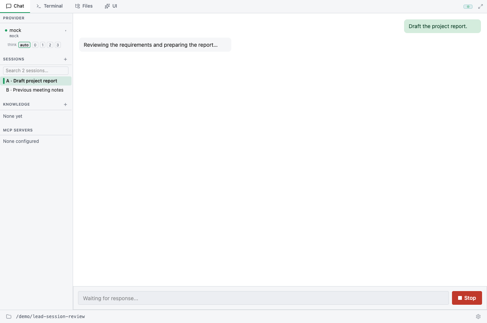
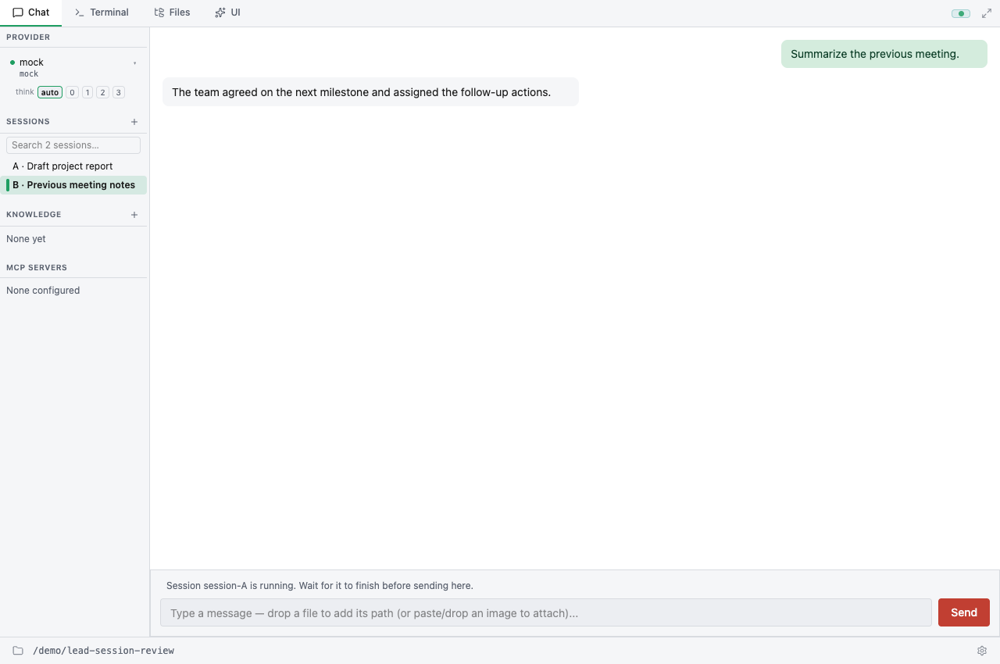

# Browse lead sessions while a turn runs

Selecting another saved session, or **New session**, changes the conversation
shown in Chat and Terminal without cancelling the lead's running turn. Return
to its session to see the accumulated output and control that turn.

There is still one lead executor. While session A runs, session B can be read,
but its composer is blocked. Wait for A to finish before sending a prompt in B.
Sending in an idle saved session activates that session and its provider/history
before executing the prompt. Existing command-line session switching remains
an execution operation.

Output, plan/goal snapshots, and turn usage remain associated with the execution
session. Approval and question UI retains the originating session. Reconnecting
restores the execution identity separately from the conversation being viewed.

This change does not add live teammate session viewing or team management.

## Verification

- `pnpm --dir frontend test`: navigation without cancellation, stale snapshots,
  event sequence boundaries, reconnect identity, input/Stop targets, questions,
  and suppression of another session's output.
- `cargo test --features gui --lib session_view`: presentation replay, plan
  preservation, event-time busy state, and IPC view/New requests that do not
  queue worker session switches or cancel the execution session.
- `cargo test --features gui --lib cancelled_gui_approval`: cancelled approval
  requests are removed before reconnect replay.
- `cargo test --features gui --lib ws_round_trip_processes_slash_command`:
  WebSocket event envelopes and reconnect identity.

For manual verification, start a long-running turn in A, select saved session B,
then select New. Confirm A continues, input in the other view is blocked, and
returning to A restores its output. Repeat with an approval/question pending
and after reconnecting. Verify Stop in A interrupts only the intended turn.

## Browser fixture captures

These are the real React UI with a simulated IPC backend. They show the state
before and after switching in this implementation, not an upstream-versus-PR
comparison or proof of a live provider run. The browser check also injected an
A output event while viewing B and verified that it did not appear in B, and
checked that navigation sent no cancellation message.

Before switching: A is running.

After switching: B is visible and its composer explains that A is still running.

## Protocol and persistence limits

Chat/Terminal presentation events are carried inside `session_event` envelopes
with `session_id`, `sequence`, and `events`. A `session_view` snapshot carries the
matching request ID and replay boundary. Raw WebSocket consumers must unwrap the
new envelopes. GUI Shell events retain their separate bridge dispatch.

Live presentation replay is kept in memory for the process lifetime. A backend
restart relies on persisted session history; reconnect to the same running
backend can replay the in-memory view. This is not a new persistent event store.
